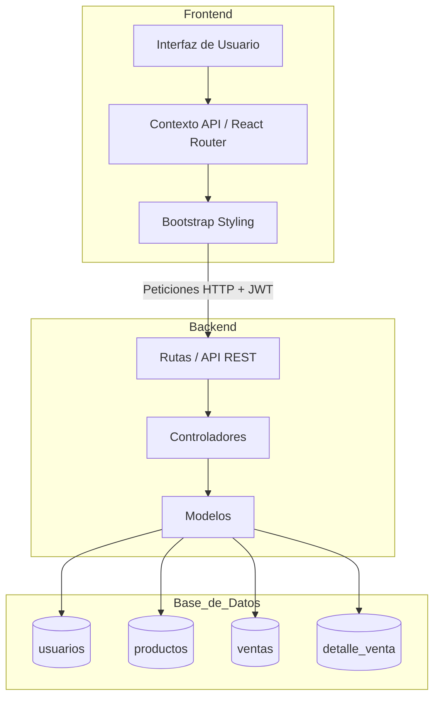

```mermaid
graph TD
    subgraph Frontend
        A[Interfaz de Usuario] --> B[Contexto API / React Router]
        B --> C[Bootstrap Styling]
    end

    subgraph Backend
        D[Rutas / API REST] --> E[Controladores]
        E --> F[Modelos]
    end

    subgraph Base_de_Datos
        G[(usuarios)]
        H[(productos)]
        I[(ventas)]
        J[(detalle_venta)]
    end

    C -->|Peticiones HTTP + JWT| D
    F --> G
    F --> H
    F --> I
    F --> J
```
